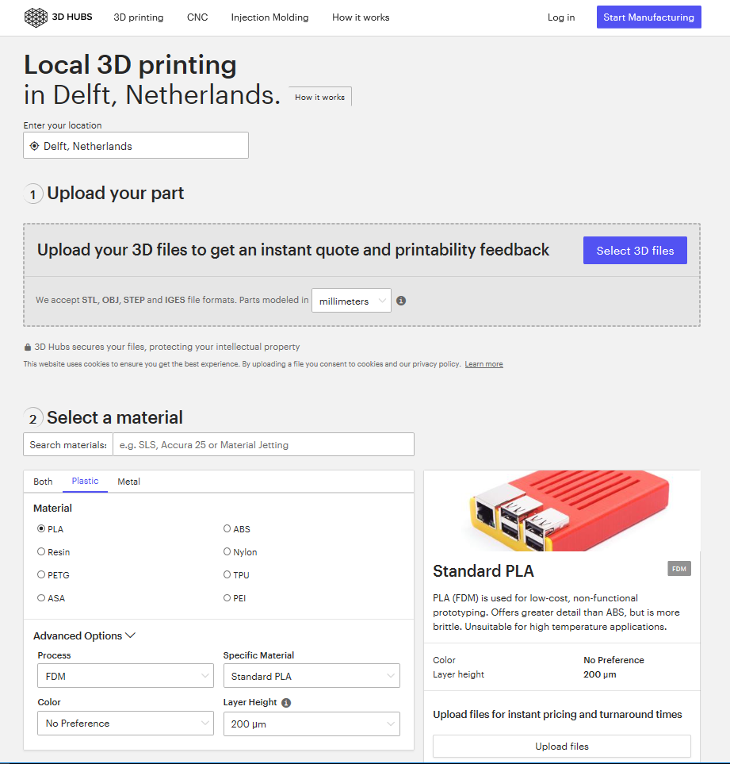
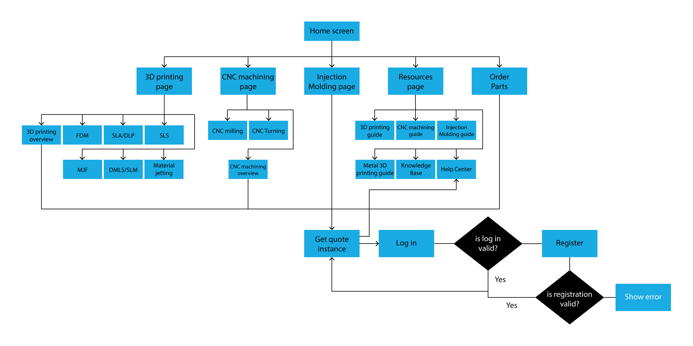
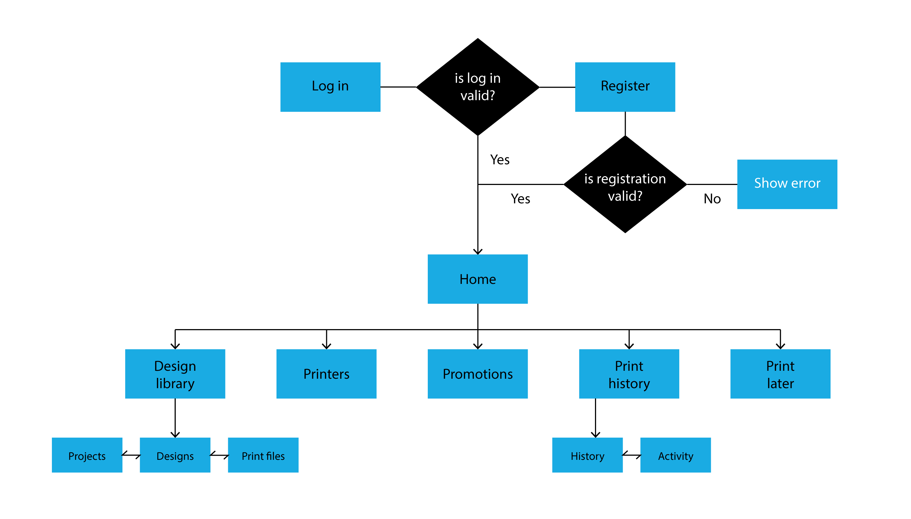
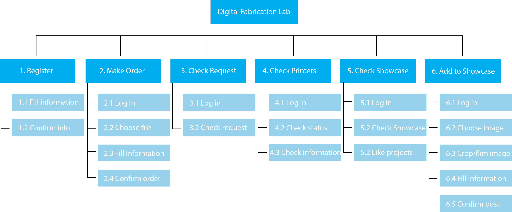
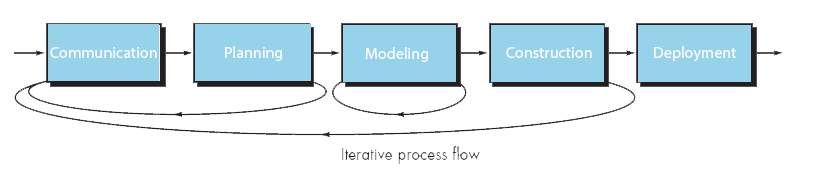

In the Introduction we described the requirements of the app. Based on the must have features we analysed a few features of existing apps/webpages. These must have features are: uploading a project easily, the user can sign in and the operator can approve/decline projects. We also looked for some options to display the showcase.

## Uploading a project

For uploading 3D files we found the website [3D Hubs](https://www.3dhubs.com/) and the app [Astroprint](https://www.astroprint.com/).

On the 3D Hubs website you can make a request to 3D print, a CNC or an injection molding job. For us the 3D printing upload page was the most interesting to look at. In figure FIXME you can see this webpage. We liked that the website shows which file types are accepted and that you can select the units.



3D Hubs also makes it quite easy to pick your required material. When you select a certain material it shows a small description and even the estimated costs, when you upload a file. You can also select some advanced options.

However, this is a website, so we can’t display that much information on a smartphone screen. We would like to put the upload button on top similar to 3D Hubs, so the app can try to predict the machine that will be used based on the file type.



In figure FIXME you see a block diagram of the 3D Hubs website, which has quite a lot of pages. This structure isn’t suitable for our app, because it is too complicated.

When you open the AstroPrint app you start at a homepage with a few navigation buttons. These buttons lead you to the most important pages. The downside of having these buttons is that you can’t switch between screens quickly. That is why we would like to make use of tabs, so you can swipe from screen to screen.

On the upload page (see figure FIXMEb) you see a 3D preview of your file, including information like the volume and dimensions. Furthermore you can select the machine, material and quality. This is pretty close to the features we would like to implement in our request page in the app. In figure FIXMEc you see the page with all the uploaded designs and projects by the user. We would like to implement a page like this as well, so the user is able to see his/her previous projects and settings.



In figure FIXME you see the block diagram of the AstroPrint app. A structure like this would be suitable for our app. It is clear and it is easy to navigate through the app. We also liked the tabs in the Design Library section, because you can switch between the pages quickly.

<br />

## Authentication and approving projects

In our app we would also like to make use of a database for signing in and storing data. We had to choose between Firebase and setting up a server by ourselves. This choice was made easily, because setting up a server takes a lot of time and skills we unfortunately don’t have.


We would like to use [Firebase Authentication](https://firebase.google.com/docs/auth/) for the login process of our app, because it is a relatively easy way to store user emails and passwords. For the storage of project orders and files we would like to use Firestore, because you can make a clear structure of collections and documents within this function. Firestore can also be used for admin webpage. This admin webpage will show the project order made by users in the app and when the admin changes for example the order or payment status, this will also show in the app.

## Showcase

We would like the extra function Showcase to have an Instagram-like feed. With this lay-out the users are able to look at and like projects from other users. They can also receive likes on their own projects.


## Rendering an STL-file

We also played with the idea to render the uploaded STL file, to show a preview, which makes it easier to see which project you're looking at, at a glance. Before we started working on the app, we created a small node-server that renders and parses (returning estimated weight, size etc.) an STL-file.

```ts
app.get("/stl-parser", (req, res) => {
  const requestSettings = {
    method: "GET",
    url: req.query.url,
    encoding: null
  };

  request(requestSettings, function(error, response, body) {
    var stl = new NodeStl(body, { density: 1.0 });
    console.log("Parsed: " + req.query.url);
    console.log(stl);

    res.contentType("application/json");
    res.send(stl);
  });
});

app.get("/thumbnailer", function(req, res, next) {
  new StlThumbnailer({
    url: req.query.url,
    requestThumbnails: [
      {
        width: 500,
        height: 500
      }
    ]
  })
    .then(function(thumbnails) {
      thumbnails[0].toBuffer(function(err, buf) {
        res.contentType("image/png");
        res.send(buf);
      });
    })
    .catch(function(err) {
      res.status(500);
      res.send("Error thumbnailing: " + err);
    });
});
```

This is still very much a possible feature for the app. However, we have not implemented it in the final result (yet), due to limited time.

# Technology exploration and analysis

<br />



## GUI

For the interface we looked at NGUI, 2D toolkit and EZ GUI. Those options are better in performance, however we chose to use GUI (despite less performance and large DrawCalls) since it is implemented in Android Studio and we worked with GUI through the whole course.

## Log in/register

There are multiple options to log in to the app, we could students NetID, Facebook account or in a new server or with Firebase Authentication. Since the app is for the TU Delft it is most likely to use the students NetID to log in, however to use those information we must have permission to access the TU Delft server which cost a lot of time and effort, this would be ideal for the full version. The option to log in with Facebook is not in line with the function of the app since it is not a social media app or has other links to Facebook within the app. Facebook log in is however easily to implement since the app get all the information from the students facebook account. We choose to use Firebase in our prototype since this is the easiest way to implement a login and register activity and store the information used for linking the user and the uploaded projects.

## Upload Files

To make it possible for students to upload files that the operator can see it is necessary to implement a storage and a database. For the real app this should be implemented using a network service cause this is is cheaper but then you have to make your own storage and database. For the prototype we choose Firebase to implement these technologies, since this is easier to use and we would not have enough time to make a whole service.

Moreover it is good to realise that students won’t have their print file on their phone, so to upload a file the app should have access to a cloud where the file is located. In the full version we should implement access to clouds like, Google Drive, Dropbox and Icloud. For now you can upload all kinds of files, suchs as images, from your phone.

## Operator part

The operator needs to approve the requests and schedule the project. Nowadays all the information about the user, project, payment status and project status is done by hand in an excel sheet. We want to implement this excel page in the project. By an extra operator app it is hard to download the file, however an app can be used everywhere at every time. A web page makes it easier to download the files and upload the files to a printer. A web page can’t be used at anytime as easily as an app. For the operator to download the files and since the use is mostly done at the office where a computer is located, it is most logical to use a webpage instead of an app. The webpage should be linked to the app so information can be exchanged very easily.

## Notifications

To give students a notification sent by the operator we can choose between push notifications or Text messages, Text messages can be opened is the home screen where Push notifications are short en opened in the app. Push notifications are completely free for users to receive while this is not always the case with text messages. Therefore we choose to implement Notifications Push programs. Examples of Push programs are: Firebase Cloud Message Google Cloud Message.
FCM is an improved version of GCM. FCM inherits GCM’s core infrastructure but simplifies the client development. With GCM you need to write your own registrations or subscription retry logic but wit FCM you can integrate it with only a few lines of code. There are some other services who generate push messages but since we already choose to use firebase for a lot of other technology implementations we decided to use it for the notifications as well, the disadvantage for using google is that googleplay should be installed at your device to receive the notifications.

## Process flow

We will work with different iterations to implement all the functions of the app. Through the project we will communicate with Adrie as well with the Digital Fabrication Lab. Therefore we choose the iterative process flow.


