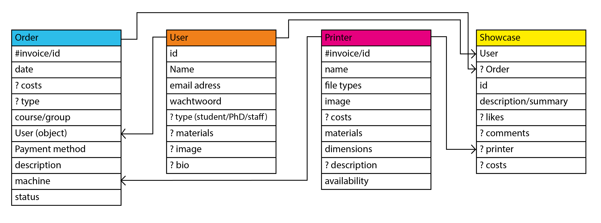
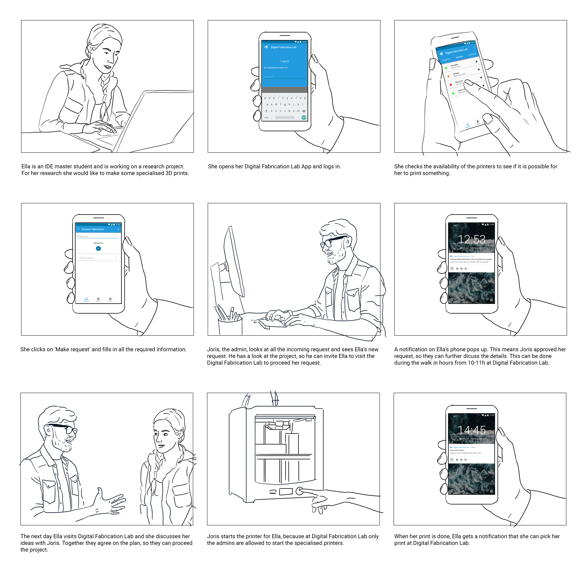
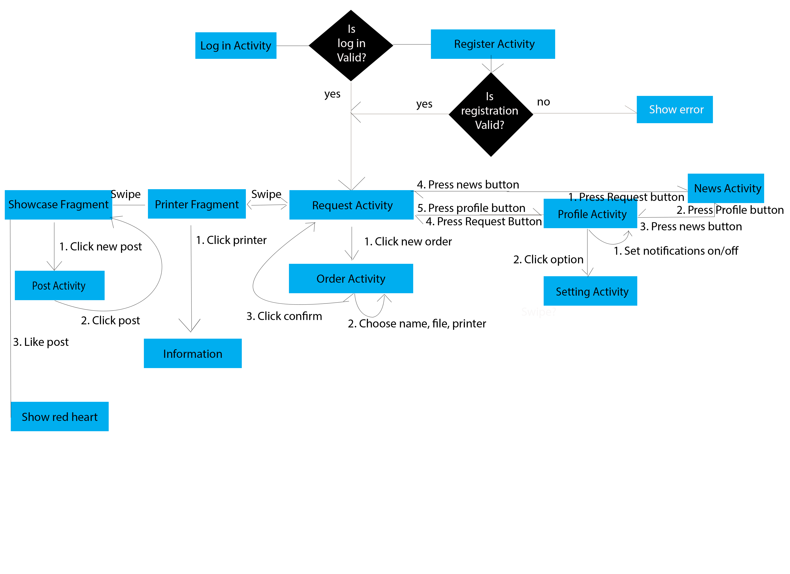

import IframeResponsive from "../../components/mdxcomponents/iframe";

We started this project by having a brainstorm about the app. We made a first setup of classes and objects on paper to get a feel of the basic structure of the app (see figure 6).

After visiting Digital Fabrication Lab and discussing all the functionalities with Tessa, we found out that the way they work was pretty close to our idea of the app. Tessa provided us with some resources, like the invoice document and some printer instructions. Based on these ideas and resources, we made a prototype using Figma. With this prototype program we could already implement real android widgets and the TU Delft style to get a real feel of the app. We also used Figma to make a first prototype of the app (see figure 7).

<IframeResponsive
  ratio={1}
  src="https://www.figma.com/embed?embed_host=share&url=https%3A%2F%2Fwww.figma.com%2Fproto%2FPMLZK9RHDNQXW6voyZHbiavS%2FApp-Design%3Fnode-id%3D0%253A1%26scaling%3Dscale-down"
/>

Figure 7: Wireframe Figma prototype

Based on this prototype we also made a storyboard to describe the user scenario of the app (see figure 8).

# Activity Diagram

Based on the Figma wireframe, we made an activity diagram to transform our ideas into a real app structure. You can see this activity diagram in figure 9.

We used this activity diagram as a start to structure the flow of our app.
