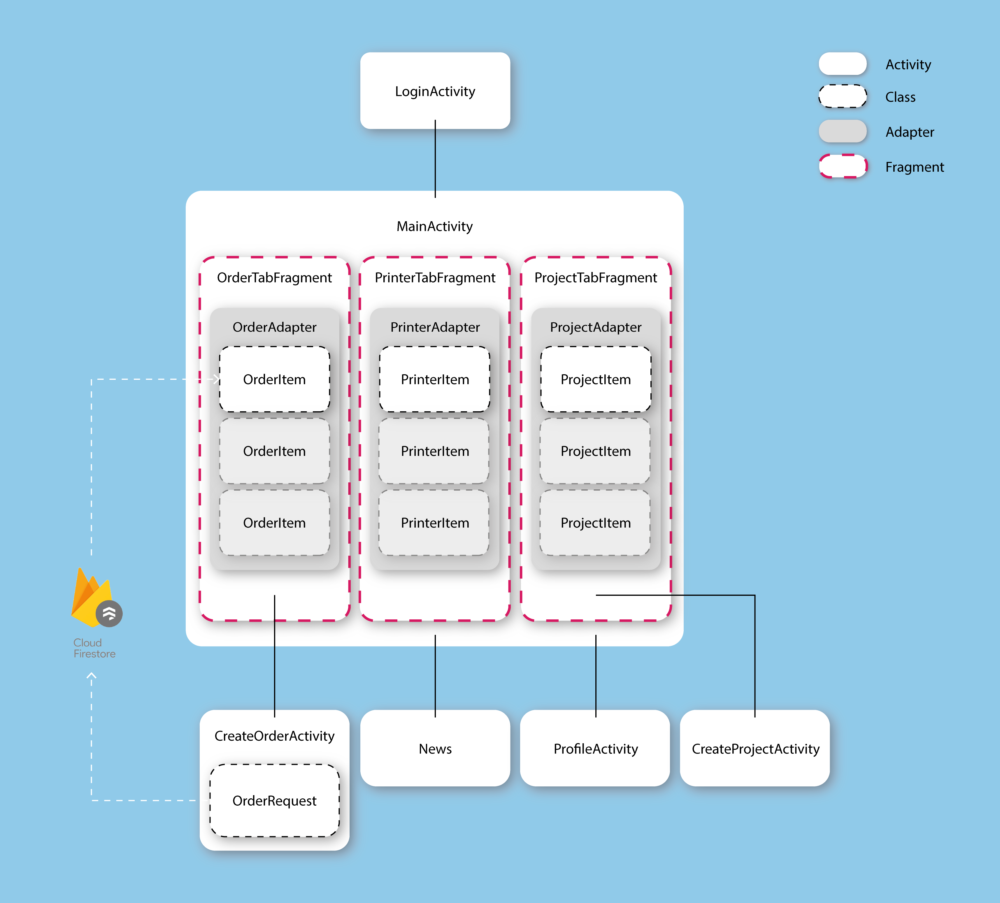

import GitLogo from "../../components/mdxcomponents/GitLogo";

# Java concepts

As we had previously determined what features we would like to implement first, we distributed tasks among the group. Annemar started working on the login and profile page and Avelien created the order page.

The first thing we discovered while programming in java, is that we had to make many more classes than we thought. During our ideation phase, we expected to create four classes (one for each data type). However, a class does not specifically match a database table, and often needs many helper classes. In the end we created TODO: classes, see the UML class diagram in figure FIXME.

- Singleton Pattern
- Factory Pattern
- Abstract Factory Pattern
- Builder Pattern
- Prototype Pattern

# Android concepts

We started structuring our app by making a LoginActivity which leads you to the MainActivity when you log in. The whole activity, fragment and intent structure can be seen in figure FIXME. In this figure the intents (which are the connections between pages) are represented by the black lines.

All intents between activities are structured like this:

`startActivity(new Intent(getApplicationContext(), MainActivity.class));`

Inside MainActivity we used three fragments to switch quickly between the different tabs in the app; the OrderTabFragment, the PrinterTabFragment and the ProjectTabFragment, which represent the Requests, Printers and Showcase tabs. We also used fragments for this, because they are inflated inside the layout of the MainActivity. Since these tabs are all related to the Order request made by the students, we chose to use them as fragments instead of different activities.



The intent to switch between the tabs looks like this:

<GitLogo src="https://github.com/nwesthoff/Digital-Fabrication-Lab/blob/cf7563cd5ff080be4fe3cc152f50c5ff5d790c39/client/app/src/main/java/com/nilswesthoff/nils/digitalfabricationlab/MainActivity.java#L120" />

```java
@Override
public Fragment getItem(int position) {
   Fragment fragment = null;
   switch (position) {
       case 0:
           fragment = new OrderTabFragment();
           break;
       case 1:
           fragment = new PrinterTabFragment();
           break;
       case 2:
           fragment = new ProjectTabFragment();
           break;
   }
   return fragment;
}
```

Each fragment holds an adapter, which show the corresponding item. The Adapters link the data from the items to the corresponding layout resource. All the items are represented by classes, which store all the required information. The OrderItem stores for example a project title, a description, a file, a printer, a group/course and the payment method. When you click on the ➕button inside the OrderTabFragment you will be lead to the CreateOrderActivity. This is the page where you can make the actual request for your order. When you press the ‘Confirm Order Request’ button you actually send all the data packed in the OrderRequest class to Cloud Firestore and OrderItem then shows this data in your order overview, which actually makes OrderRequest and OrderItem the same class 🤔.

We also have a bottom navigation bar, which navigates to the News and Profile activity. The pages Request, News and Profile are however not related to each other and therefore these are separated activities.

# GUI

The app contains a lot of different functions and activities. The navigation to the pages should be easy and clear. Moreover all different functions and activities should have the same layout style.
Since the app is a project for the TUDelft we choose to implement the style of all TU Delft websites and apps. Therefore the colors blue, grey and white are used. We used the color pink to highlight some elements.

## Login page

By making the Sign in button pink and the Register button grey the Sign in button stands out more and it is clear for the user to click on the button.

## Edit pages (Order, Register, Settings)

For the register, profile settings and add request page we used the similar layout the get consistency in the app. The edit text fields have grey hints and the pages start with a rounded image.

Because we used the rounded images in this pages, all profile images and add buttons used in the app are a `<CircleImageView />`.

<GitLogo src="https://github.com/nwesthoff/Digital-Fabrication-Lab/blob/0abff025e227eb2d6a9e62f2c8b9684feab135ec/client/app/src/main/res/layout/activity_profile.xml#L54" />

```xml
<de.hdodenhof.circleimageview.CircleImageView
android:layout_width="40dp"
android:layout_height="40dp"
android:id="@+id/image_profile"/>
```

By clicking on the confirm buttons you go to the previous page. So confirm project → back to request fragment. Confirm settings → back to profile page. By clicking Register you go to the start screen which is the request fragment. If you want to go back you can click on the arrow to the left of your android navigation bar.

## Tab navigation and bottom navigation bar

Since nowadays all screens are very large, we used a bottom navigation bar to navigate to the pages: request, news and profile. With the blue icon the user can see in what page he is in.

Since the overview of the requests, printers and showcase are all linked to the request page we use fragments within the request page to navigate to those features. With the pink line underneath the tab name, the user can see in which fragment he is.

## Showcase and requests fragment

The showcase en the requests fragment are both an overview. Therefor the pages have a quite similar layout. Both pages look a bit like an instagram feed. In the showcase you can also like public projects. For the layout we used a RecyclerView. The items shown have a separate item xml file to define the layout of the items.

# Database, authentication and storage

## firebase

As previously stated, we use Firebase for authentication, file storage and as a database.

### Authentication

Authentication is fairly simple to implement using Firebase. On the LoginActivity, users can log in using their email. When the user clicks on the login button, the following function will be called.

<GitLogo src="https://github.com/nwesthoff/Digital-Fabrication-Lab/blob/5004688dcd30ad10aec6b2e06125eba0aa6af1b5/client/app/src/main/java/com/nilswesthoff/nils/digitalfabricationlab/Users/LoginActivity.java#L66" />

```java
public void LoginUser() {
   String Email = email.getText().toString().trim();
   String Password = password.getText().toString().trim();
   mAuth.signInWithEmailAndPassword(Email, Password)
           .addOnCompleteListener(this, new OnCompleteListener<AuthResult>() {
               @Override
               public void onComplete(@NonNull Task<AuthResult> task) {
                   if (task.isSuccessful()) {
                       currentUser = mAuth.getCurrentUser();
                       finish();
                       startActivity(new Intent(getApplicationContext(),
                               MainActivity.class));
                   } else {
                       Toast.makeText(LoginActivity.this, "couldn't login",
                               Toast.LENGTH_SHORT).show();
                   }
               }
           });
}
```

Afterwards, the users' data can be retrieved with the `getCurrentUser()` method. This method is available anywhere from the application now.

### Storage

All images and files that the users of the app upload, get put in a Firebase Storage bucket. In our `CreateOrderActivity`, we created a method `uploadFile()`, which checks whether a file has been selected, uploads it, and then returns the `hostedUri`, which will be used when the order is actually stored in the database.

<GitLogo src="https://github.com/nwesthoff/Digital-Fabrication-Lab/blob/5004688dcd30ad10aec6b2e06125eba0aa6af1b5/client/app/src/main/java/com/nilswesthoff/nils/digitalfabricationlab/Orders/CreateOrderActivity.java#L226" />

```java
private void uploadFile() {

   if (localUri != null) {

       final ProgressDialog progressDialog = new ProgressDialog(this);
       progressDialog.setTitle("Uploading...");
       progressDialog.show();

       final StorageReference orderFile = storageReference.child("files/" + displayName);

       orderFile.putFile(localUri).addOnProgressListener(new OnProgressListener<UploadTask.TaskSnapshot>() {
           @Override
           public void onProgress(UploadTask.TaskSnapshot taskSnapshot) {
               double progress = (100.0 * taskSnapshot.getBytesTransferred() / taskSnapshot.getTotalByteCount());
               progressDialog.setMessage(((int) progress) + "% Uploaded...");
           }
       }).continueWithTask(new Continuation<UploadTask.TaskSnapshot, Task<Uri>>() {
           @Override
           public Task<Uri> then(@NonNull Task<UploadTask.TaskSnapshot> taskSnapshot) throws Exception {


               if (!taskSnapshot.isSuccessful()) {
                   throw taskSnapshot.getException();
               }

               // Continue with the task to get the download URL
               return orderFile.getDownloadUrl();
           }
       }).addOnCompleteListener(new OnCompleteListener<Uri>() {
           @Override
           public void onComplete(@NonNull Task<Uri> task) {
               if (task.isSuccessful()) {
                   progressDialog.dismiss();
                   hostedUri = task.getResult();
                   Toast.makeText(getApplicationContext(), "File Uploaded", Toast.LENGTH_LONG).show();
               } else {
                   progressDialog.dismiss();
                   Toast.makeText(getApplicationContext(), task.getException().getMessage(), Toast.LENGTH_LONG).show();
               }
           }
       });

   } else {
       //display an error toast
   }
}
```

### Database

We're using Firebase Firestore for the database. Further on in CreateOrderActivity, we created the filledIn() method, where we store our Orders in the database. This picks up on the previously set values in text, the authenticated user, as well as the hostedUri that we received from the uploadFile() method.

<GitLogo src="https://github.com/nwesthoff/Digital-Fabrication-Lab/blob/0abff025e227eb2d6a9e62f2c8b9684feab135ec/client/app/src/main/java/com/nilswesthoff/nils/digitalfabricationlab/Orders/CreateOrderActivity.java#L304" />

```java
private void filledIn() {
DocumentReference printer = db.collection("Printers").document(clickedPrinterId);

Date date = new Date();
String email = currentUser.getEmail();
User user = new User();
user.setEmail(email);

// Files
Map<String, Object> file = new HashMap<>();
file.put("fileName", displayName);
file.put("fileUrl", hostedUri.toString());

// Order Request
Map<String, Object> orderRequest = new HashMap<>();
orderRequest.put("title", project_title.getText().toString().trim());
orderRequest.put("description", description.getText().toString().trim());
orderRequest.put("course", course_group.getText().toString().trim());
orderRequest.put("baan", baan_code.getText().toString().trim());
orderRequest.put("date", date);
orderRequest.put("user", user);
orderRequest.put("status", "ordered");
orderRequest.put("files", Arrays.asList(file));
orderRequest.put("printer", printer);

if (!TextUtils.isEmpty(project_title.getText().toString().trim())) {

       db.collection("Orders").add(orderRequest).addOnSuccessListener(new OnSuccessListener<DocumentReference>() {
           @Override
           public void onSuccess(DocumentReference documentReference) {
               Log.d(TAG, "DocumentSnapshot written with ID: " + documentReference.getId());
               //Confirmation text
               Toast.makeText(CreateOrderActivity.this, "CreateOrderActivity confirmed", Toast.LENGTH_LONG).show();
               Intent intent1 = new Intent(CreateOrderActivity.this, MainActivity.class);
               startActivity(intent1);
           }
       }).addOnFailureListener(new OnFailureListener() {
           @Override
           public void onFailure(@NonNull Exception e) {
               Log.w(TAG, "Error adding document", e);
               //Confirmation text
               Toast.makeText(CreateOrderActivity.this, "Error adding orderRequest", Toast.LENGTH_LONG).show();
           }
       });

    } else {
        Toast.makeText(this, "Enter your CreateOrderActivity Title", Toast.LENGTH_LONG).show();
    }
}
```

We obviously want to query this data in the app again as well. Which we do in our OrderTabFragment. Because the API call to Firestore is async, the data comes in after the UI has been created. We create an ArrayList of Orders, which we will fill after the onComplete callback has fired from our readData method.

<GitLogo src="https://github.com/nwesthoff/Digital-Fabrication-Lab/blob/0abff025e227eb2d6a9e62f2c8b9684feab135ec/client/app/src/main/java/com/nilswesthoff/nils/digitalfabricationlab/Orders/OrderTabFragment.java#L69" />

```java
private void readData(final FirestoreCallback firestoreCallback) {
   mAuth = FirebaseAuth.getInstance();
   currentUser = mAuth.getCurrentUser();

   CollectionReference OrdersRef = db.collection("Orders");
   Query query = OrdersRef.whereEqualTo("user.email", currentUser.getEmail())
           .orderBy("date", Query.Direction.DESCENDING);

   query.get().addOnCompleteListener(new OnCompleteListener<QuerySnapshot>() {
       @Override
       public void onComplete(@NonNull Task<QuerySnapshot> task) {
           if (task.isSuccessful()) {
               for (QueryDocumentSnapshot document : task.getResult()) {
                   OrderItem order = document.toObject(OrderItem.class);
                   Orders.add(order);
               }
               firestoreCallback.onCallback(Orders);
           } else {
               Log.d(TAG, "Error getting documents: ", task.getException());
           }
       }
   });
}
```

We ended up fixing this problem because of this [video](https://www.youtube.com/watch?v=0ofkvm97i0s).
