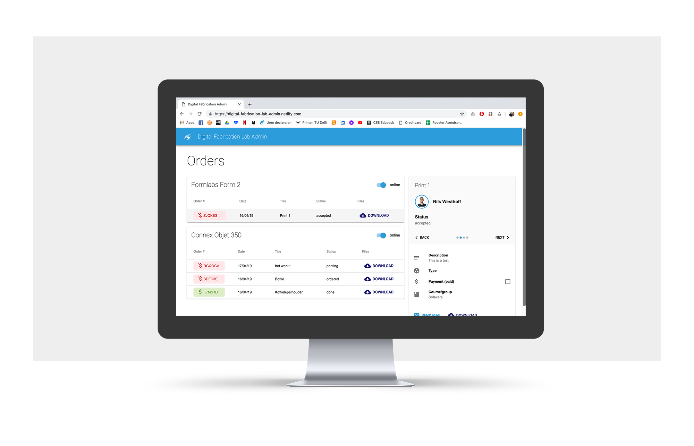

import { Button, Grid, Switch } from "@material-ui/core";
import IframeResponsive from "../../components/mdxcomponents/iframe";
import GitLogo from "../../components/mdxcomponents/GitLogo";
import NetlifyLogo from "../../images/netlify-logo.svg";



The app is connected to the admin panel, which will be used by Tessa and Joris, the printer operators 🖨. The admin panel is written in [Typescript](https://www.typescriptlang.org/) (optionally typed Javascript 😍) and built with [React](https://reactjs.org/), a JavaScript library for building user interfaces. React makes it easy to create reusable components.

# Typescript Concepts

Typescript, like Java is an object oriented language, and like Java, it has to be compiled before being able to run (unlike Javascript).

# React Concepts

In React you write components that manage their own state. A React component (usually) contains the display and logic in a single place container. React doesn't separate concerns by splitting logic from layout, as is usual. React allows you split up your application in as many components as you like. Data is passed to child components using props (top-down direction).

A basic React (stateful) component looks like this:

```tsx
export default class Header extends Component {
  constructor {
    super(props);
    // creates initial state open = false
    this.state = { open: false };
  }

  handleClose = () => {
    // setState manages state in React, and rerenders
    this.setState({ open: !this.state.open });
  };

  render() {
    return (
      <div>
        // clicking the button calls handleClose function to toggle open state
        <button onClick={this.handleClose}>
          // references an icon
          <MenuIcon />
        </button>
        // the drawer component knows what to render for each state
        <Drawer open={this.state.open}>
          // generic React child component
          <DrawerList />
        </Drawer>
      </div>
    );
    }
  }

```

As the admin panel is quite simple, the project doesn't consist of many components. The `<App />` component holds the _Header_,
_Notification_ container and a _router_ component.

<GitLogo src="https://github.com/nwesthoff/Digital-Fabrication-Lab/blob/master/admin/src/app.tsx" />

```tsx
export default class App extends React.Component {
  render() {
    return (
      // <MuiThemeProvider /> passes our custom theme to all child components
      <MuiThemeProvider theme={materialTheme}>
        <AppBar position="sticky">
          <Toolbar>
            <Grid container spacing={16} alignItems="center">
              <Grid item>
                <Avatar src={fabricationLabLogo} />
              </Grid>
              <Grid item>
                <Typography variant="h6" color="inherit">
                  Digital Fabrication Lab Admin
                </Typography>
              </Grid>
            </Grid>
          </Toolbar>
        </AppBar>
        <Router>
          // public routes require no authentication and will display the
          specific component without being logged in
          <PublicRoute path="/admin/login" component={Auth} />
          // Protected routes check whether the user is logged in first, before
          redirecting them to the passed component
          <ProtectedRoute
            default
            path="/admin/dashboard"
            component={Dashboard}
          />
        </Router>
        <Notifications />
      </MuiThemeProvider>
    );
  }
}
```

As you can see, almost anything can be a prop, strings, objects, functions or even whole React components.

# GUI

To match the look and feel of the Android app, we chose to use a [Material UI](https://material-ui.com/) Library to quickly build the GUI of the admin panel. We're using several reusable components from the material library, including:

```tsx
<Grid />
<Card />
<Table />
<Button />
<Switch />
```

A button and switch, for example. Look like this:

<Grid container direction="row" alignItems="center">
  <Grid item>
    <Button color="primary" variant="contained">
      Button
    </Button>
  </Grid>
  <Grid item>
    <Switch color="primary" checked />
  </Grid>
</Grid>

<br />

All these small components from the Material-UI library make it easy to build a nice, consistent interface quickly.

<Button
  href="https://digital-fabrication-lab-admin.netlify.com"
  target="blank"
  style={{ paddingRight: "1rem", marginBottom: ".8rem" }}
>
  
  Admin Panel
</Button>

_you can currently log in without any username and password_ 😉

# Implementation of technologies

The Admin panel depends on a few parts.

- [Reach router](https://reach.tech/router)
- [Firebase](https://firebase.google.com/) Firestore/Auth
- [MobX](https://mobx.js.org/) (global data store)
- [Netlify](https://www.netlify.com/) (Git automated CI/deploy)

## Reach Router

In SPA's (single-page-applications), it's common to use a router to determine which components to show a user. The router checks the current URL and displays the

We created two custom components to check for authentication. If the user is authenticated, the component returns the specified components (which can be passed as a prop). If the user is not authenticated, it will show the Auth component (the login page).

<GitLogo src="https://github.com/nwesthoff/Digital-Fabrication-Lab/blob/master/admin/src/components/auth/ProtectedRoute.tsx" />

```tsx
export default class ProtectedRoute extends React.Component<Props> {
  render() {
    const { component: Comp, ...props } = this.props;
    return userSessionStore.isLoggedIn ? <Comp {...props} /> : <Auth />;
  }
}
```

The PublicRoute component just passes the component and its props without checking for authorization. This component doesn't serve any functional purpose, but it is more declarative, since you will know right away that the component is a public one.

<GitLogo src="https://github.com/nwesthoff/Digital-Fabrication-Lab/blob/master/admin/src/components/auth/PublicRoute.tsx" />

```tsx
const PublicRoute = ({ component: Component, ...rest }) => (
  <Component {...rest} />
);
```

## Firebase Firestore

The client app uses Firestore to store data, so it makes sense to pull the data from there as well 🤓. The Javascript API is quite similar to the Java API, so it was quite easy to implement. We expose a function to fetch a collection based on its name.

<GitLogo src="https://github.com/nwesthoff/Digital-Fabrication-Lab/blob/0abff025e227eb2d6a9e62f2c8b9684feab135ec/admin/src/api/firestore.ts#L10" />

```tsx
export const fetchCollection = (collectionName: string) => {
  return db
    .collection(collectionName)
    .get()
    .then(res => {
      return res.docs.map(collection => {
        const returnCollection = collection.data();
        returnCollection.id = collection.id;
        return returnCollection;
      });
    });
};
```

The `fetchCollection` function is then used by `fetchData()` in our global DataStore (provided by MobX). The `fetchData()` action populates `orders[]` in our DataStore when it's referenced.

<GitLogo src="https://github.com/nwesthoff/Digital-Fabrication-Lab/blob/0abff025e227eb2d6a9e62f2c8b9684feab135ec/admin/src/stores/datastore.tsx#L9" />

```tsx
export class DataStore {
...
 @observable
 orders: Order[] = [];
 @observable
...
 @action
 fetchData() {
   fetchCollection("Printers").then(res => {
     this.printers = res;
   });

   fetchCollection("Orders").then(res => {
     this.orders = res;
   });

   fetchCollection("users").then(res => {
     this.users = res;
   });
 }
}
```

We then call the `fetchData` action in React's `componentDidMount` lifecycle method in the _Dashboard_ component. This data is now available from anywhere in our admin interface.

<GitLogo src="https://github.com/nwesthoff/Digital-Fabrication-Lab/blob/0abff025e227eb2d6a9e62f2c8b9684feab135ec/admin/src/components/dashboard/dashboard.tsx#L74" />

```tsx
export default class Dashboard extends React.Component<Props, State> {
...
 componentDidMount = () => {
   dataStore.fetchData();
 };
...
}
```

## MobX

[MobX](https://mobx.js.org/) provides simple, scalable state management. This means that all data that is passed to our dataStore, is available from any component in our application. This means you don't have to do [prop-drilling](https://kentcdodds.com/blog/prop-drilling/) (recursively passing data to child components) as you usually do with React. This is an anti-pattern though. Usually, applications with global state management are easier to break (by removing a useful piece of code). However, our Admin interface is not that complex, and Typescript tells us whether a particular value from the store is used or not. That's why we determined MobX can help us get the admin interface up and running.

## Netlify

The admin interface deploys automatically from Git to [Netlify](https://www.netlify.com/) (as does this report). So every time a commit (or preferably a pull-request) is made to the master branch of the Digital-Fabrication-Lab repo, Netlify will deploy the newest version automatically. A manual deploy can also be previewed and triggered from the develop branch.
