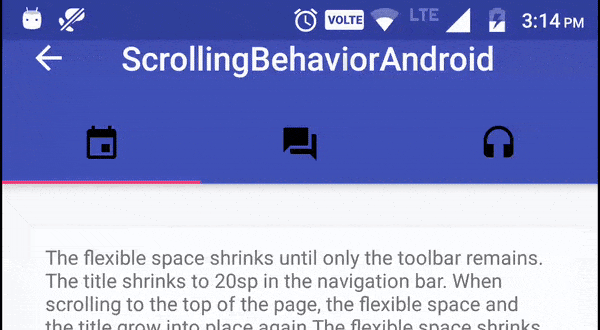

# Conclusion

During this project everybody had a clear role in our group. We divided the three fragments, so everybody could start coding from scratch, despite from the different experience levels. Avelien worker on the Order tab, Nils on the Printer tab and the admin webpage and Annemar worked on the Showcase tab. The communication went surprisingly well even though we couldn’t always work together during the regular study hours. During the first weeks of the projects we worked quite separately on our fragment. We all learned a lot from this, because we really had to program something by ourselves. The last few weeks we put everything together and helped each other with the problems in our section. This resulted in an app and admin webpage we are quite happy with 😊. Of course there are always some parts that could have been executed better or with more detail, but these are listed in our recommendations for further development:

# Recommendations

**Security**

- Now the app allows anyone to sign up and create orders (misses back-end logic)
- Admin panel has no auth at all
- We would like the students to be able to login with their TU Delft NetID

**Functionality App**

- 🚨🚨🚨KEEP USER LOGGED IN 🚨🚨🚨
- Notifications do not work yet
- Showing showcases correctly
- Printer information; make the printers in the printer tab clickable to see more information and - show which material is currently in the printer.
- News page
- Give error when you upload a wrong file format for the printer you selected
- Choose material based on selected printer and the material that is currently in the printer.

**Layout App**

- Change colour of bottom navigation bar, when you’re in another activity. Now it always seems like - you’re in the request activity.
- Overall lay-out prettier, now we focused on making the app work.
- Make the tab bar scroll-able
  

**Functionality Admin**

- Admin has no pagination
- Admin can't disapprove any orders
- Orders have random invoice ID, could be fixed with Firestore Transaction
- Add news items
- Change printer information
