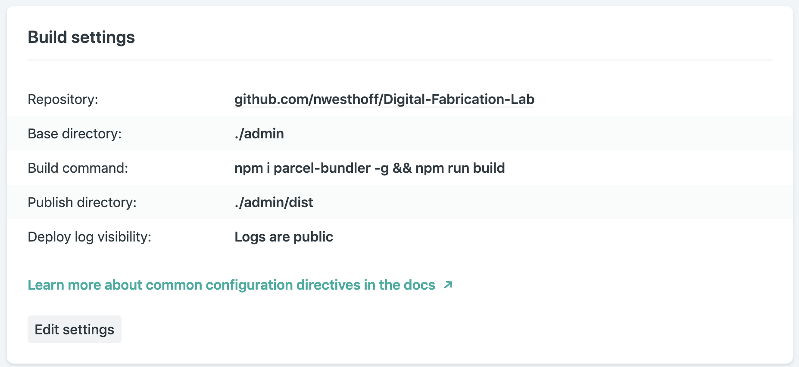

As explained in the previous chapters, the Digital Fabrication Lab consists of several parts. To get the app up and running in its current state is fairly easy (however, not recommended due to the previously mentioned recommendations).

1. Create a Google user and create a Firebase instance, the app uses the authentication, database and storage modules.
2. The React admin is standalone, and is currently hosted at Netlify (for free), but can run on any server that serves html and javascript (after being compiled)
   - To deploy self-hosted, install node (with npm), clone the repository and run `npm i && npm run build`, copy the contents of the dist folder to the server
   - To deploy at Netlify use the following deploy the Digital-Fabrication-Lab repo with the following settings:
     
3. The app itself should be released.
   - Use the `google-services.json` file (documentation) from the previously created Firebase instance
   - Create a signed apk/bundle
   - Release to the app store
